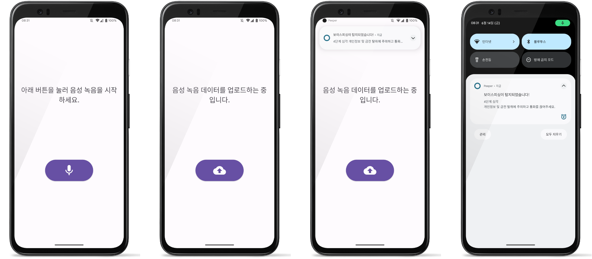

# 🩺 Project PEEPER

실시간 음성통화 분석을 통한 보이스피싱 탐지 및 안내 시스템
 
프로젝트명인 PEEPER은 Pishing Keeper의 줄임말로, 보이스피싱에 취약한 사용자를 피싱으로부터 보호한다는 의미를 담았습니다.
 
음성통화를 별도의 HW 장비를 통해 녹음하고 이를 실시간으로 서버에 업로드하면, 사전에 구성한 프롬프트에 따라 LLM 기반의 음성통화 내용 분석이 진행됩니다.
 
분석 결과, 보이스피싱임이 탐지되는 경우 사용자에게 경고 알림을 보내어 전화를 끊도록 유도하거나, 대화 내용을 더욱 명확히 할 수 있는 질문을 제안하는 작업을 수행합니다.

---

## 🐥 TEAM
| [유용민](https://github.com/yymin1022) | [오재환](https://github.com/hur2) | [임윤지](https://github.com/abt576) |
| --- | --- | --- |
|  |  |  |
| Leader / Android / HW / Infra | AI Server | Back-End |
| 소프트웨어학부 "19 | 소프트웨어학부 "19 | 소프트웨어학부 "21 |
 
 

---

## 📱 Screenshots

---

## 🎖️ Tech Stacks
### App Client
 

### Back-End
 

### Environment
   

### Communication
 

---

## 🤝 GitHub Rules
### All Rules are [here](https://github.com/Peeper-CAU/Peeper_Android/blob/main/Convention.md).
 
 
